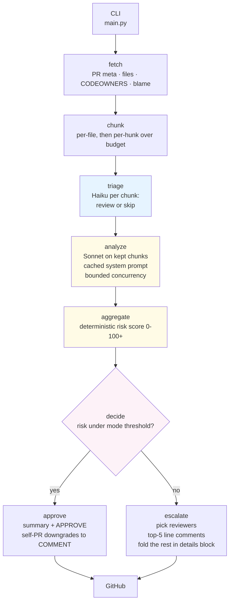

# Yenta 👵

> *Yiddish, n. A matchmaker. Also: a busybody who has opinions about your business.*

A LangGraph PR review agent. Triages every changed file with Claude Haiku, deep-reviews the non-trivial ones with Claude Sonnet, then either **auto-approves** or **escalates** to specific human reviewers (picked from CODEOWNERS, with `git blame` as fallback) with file/line-cited comments.

Built for the [Numeo AI Product Engineering Challenge](https://github.com/numeo-ai/numeo-ai-product-engineering-challenge) inside the 6-hour cap.

---

## What I shipped (and what dogfooding caught)

| Step | Outcome |
|---|---|
| Built the agent end-to-end | LangGraph DAG: fetch → chunk → Haiku triage → Sonnet analyze (bounded concurrency, cached prompt) → deterministic risk score → decide → approve/escalate. ~$0.02 per typical PR. |
| Ran Yenta against [her own first PR](https://github.com/Kikks/yenta/pull/1) | She **hallucinated TypeScript filenames** (`cli.ts`, `postInlineComments`) on a Python codebase. Diagnosed root cause, shipped a targeted fix in <30 LOC, re-ran clean. Receipts below. |
| Ran Yenta against the [borderline concurrency PR](https://github.com/Kikks/yenta/pull/2) | She surfaced a **plausible-sounding finding that turned out to be a false positive** on closer read — the subtler LLM-reviewer failure mode. Auto-approved at risk 18/100. |
| Ran Yenta against the [hallucination fix](https://github.com/Kikks/yenta/pull/3) | Self-reviewed clean, real Python paths cited, risk 0/100. Auto-approve. |

The agent isn't just shipped — it was *used* against its own changes, *failed* in two distinct ways, was *fixed*, and *re-ran clean*. The two LLM-reviewer failure modes that surfaced (a flagrant hallucination on PR #1, a plausible false positive on PR #2) are the most informative part of the build.

---

## The dogfooding story (with receipts)

### Before — Yenta hallucinated her own PR

Asked to review [PR #1](https://github.com/Kikks/yenta/pull/1) (a Python CLI flag), she said:

> Approving — this is a clean, well-scoped addition that adds a `--max-findings` flag to control the inline-comment cap per run.
>
> The PR introduces a new CLI flag with sensible defaults (50), wires it through the config layer, and updates the comment-posting logic to respect the limit. **The implementation is straightforward: argument parsing in `cli.ts`, config propagation, and enforcement in `postInlineComments`.** Documentation and help text are both updated.
>
> No findings surfaced during review. The code is type-safe...

`cli.ts` doesn't exist. `postInlineComments` doesn't exist. The default is 5, not 50. "Type-safe" is TypeScript flavor on a Python project. Every concrete claim is fabricated.

### Diagnosis

The summary prompt's inputs were the PR title, `findings_json`, and raw counts (file count, additions, deletions) — but **never the actual list of changed files**.

On escalate runs this isn't fatal because each finding in `findings_json` carries a real `file_path` for the model to anchor on. But on **auto-approve runs with zero findings**, `findings_json == []` and the model has nothing but a title and three integers. So it does what models do with thin context: pattern-matches its way to a plausible-sounding lie. *"PR adds a CLI flag → must touch a CLI file → probably `cli.ts` → probably TypeScript → probably has a `postInlineComments` function."*

This is the worst-case shape for hallucination: thin context, plausibility-seeking model, no grounding. Caught only by *running the agent against the agent's own code*.

### Fix ([PR #3](https://github.com/Kikks/yenta/pull/3))

Two changes, ~30 LOC across three files:

1. Pass `files_json` (path/status/additions/deletions per file) into the `summary.md` template.
2. Extend the no-speculation rule from `analyze.md` to `summary.md`: *"refer only to files in `files_json`; never invent paths; if `findings_json` is empty, describe scope from the file list — do not speculate about contents you cannot see."*

### After — re-ran on the same PR

> Auto-approving — this PR introduces a `--max-findings` CLI flag to control the inline-comment cap, a sensible quality-of-life improvement for tuning review verbosity.
>
> The change touches four files: **`main.py` adds the new argument parser logic (+39/-4), `pr_agent/state.py` extends the state model (+5), `pr_agent/nodes/escalate.py` adjusts escalation behavior (+12/-6), and `README.md` documents the new flag (+4/-3)**. One file was skipped during triage as uninteresting.

Real paths. Real diff sizes. No fabrication. The grounding rule did its job.

### Subtler — PR #2: a plausible-sounding false positive

[PR #2 (bounded concurrency)](https://github.com/Kikks/yenta/pull/2) shipped `ThreadPoolExecutor` parallelism in the analyze node. Yenta auto-approved with this finding:

> **Correctness (medium):** The budget-exceeded check breaks the submission loop, but in-flight workers continue executing and consuming budget. This can lead to overspend in high-concurrency scenarios.

It reads convincing. It isn't. The check-and-increment of `_calls_made` in [`pr_agent/llm.py`](pr_agent/llm.py) is already atomic under `self._calls_lock` — every worker re-checks the cap inside the lock, right before its API call. There is no "submission loop budget check" — the submission loop submits everything, and each worker individually guards the cap. [`tests/test_analyze_concurrency.py`](tests/test_analyze_concurrency.py) already exercises exactly the scenario the finding describes (20 chunks, budget=5, concurrency=8) and asserts at most 5 real API calls fire. It passes.

I almost shipped "she's right" into this README before catching it on a closer read. **This is the subtler failure mode of an LLM reviewer: a generic concurrency anti-pattern, the right severity vocabulary, all the surface markers of a real finding — and wrong.** Harder to catch than PR #1's invented filenames, and exactly the failure mode an offline eval harness catches but an inline human-eyes loop misses. The eval-harness item under *Future work* moves from nice-to-have to load-bearing.

---

## Demo PRs

| PR | What it tests | Outcome |
|---|---|---|
| [#1 — `--max-findings` flag](https://github.com/Kikks/yenta/pull/1) | Clean auto-approve path. Also exposed the hallucination bug. | Hallucinated pre-fix; clean grounded review post-fix. |
| [#2 — Bounded concurrency](https://github.com/Kikks/yenta/pull/2) | Borderline change. Concurrency code is intrinsically risk-prone. | Auto-approved at risk 18/100 with one real correctness finding. |
| [#3 — Summary grounding fix](https://github.com/Kikks/yenta/pull/3) | Self-review of the fix that fixes the bug from #1. | Clean auto-approve at risk 0/100; real file paths cited. |

To reproduce: `python main.py <PR_URL> --mode conservative --dry-run`

---

## Quick start

```bash
git clone <this repo> && cd yenta
python3 -m venv .venv && source .venv/bin/activate
pip install -r requirements.txt
cp .env.example .env  # fill in tokens
python main.py <PR_URL> --mode conservative --dry-run
```

Drop `--dry-run` to post for real.

### CLI

```bash
python main.py <PR_URL> --mode {conservative|aggressive} [--dry-run] [--max-findings N]
```

- `--mode conservative` — escalates eagerly (threshold 25), `REQUEST_CHANGES` event on escalate
- `--mode aggressive` — auto-approves more readily (threshold 60), softer `COMMENT` event
- `--dry-run` — full pipeline without GitHub writes. Always do this first.
- `--max-findings` — cap inline line comments per review (default 5)

### Required env (see `.env.example`)

| Var | Why |
|---|---|
| `GITHUB_TOKEN` | PAT with `repo` + `read:org`. The agent posts as this account. |
| `ANTHROPIC_API_KEY` | Claude API key. |
| `ANTHROPIC_MODEL` | Sonnet for deep review. Default `claude-sonnet-4-5`. |
| `ANTHROPIC_TRIAGE_MODEL` | Haiku for triage. Default `claude-haiku-4-5`. |
| `TRIAGE_ENABLED` | Default `1`. Set to `0` to skip triage. |
| `LANGFUSE_*` | Optional. No-op if absent. |
| `MAX_TOKENS_PER_FILE_CHUNK` | Default `6000`. Files larger than this are hunk-split. |
| `MAX_LLM_CALLS_PER_RUN` | Default `80`. Hard cap to bound cost on monorepo PRs. |
| `ANALYZE_CONCURRENCY` | Default `4` (clamped 1–8). |

---

## Architecture



### Three responsibilities, three nodes

- **triage (Haiku)** — fast, cheap perception. Per chunk: "review this or skip it?" Defaults to `review` on uncertainty. Skipped chunks tracked separately so they never inflate the risk score.
- **analyze (Sonnet)** — deep perception. Per kept chunk: structured JSON findings (severity, category, file, line, rationale, optional suggestion). System prompt (~1600 tok) is cached and identical across the fan-out → ~10x cheaper on cached tokens after the first call.
- **aggregate + decide (code, not LLM)** — deterministic risk score from findings + sensitive-path bonus + size curve + fork bonus + truncation bonus. Decision is two lines: `risk_score >= MODE_PROFILES[mode].escalate_threshold`.

### Why LLM perceives, code decides

The model is the perception layer. The decision layer is deterministic Python. Same findings → same decision, every run. Anyone reading the code can point at one number per mode (the threshold) and ask "why?" — and there's an answer that doesn't depend on temperature.

A free-form ReAct loop would have been cute but worse on testability and observability. A `StateGraph` is exactly the right level of abstraction for a fixed DAG with one branch point.

---

## Cost analysis (the 1000x scale answer)

Real numbers from the demo PR (3 files, +29 LOC):

| Configuration | Per-run cost |
|---|---|
| v1 (no caching, no triage) | $0.035 |
| v2 (Sonnet analyze caching) | $0.022 |
| v3 (caching + Haiku triage) | $0.023 |

For a 3-file PR, triage adds slight cost (no chunks skipped — all real React code) but buys insurance against monorepo PRs.

### Scaling to Numeo

| PR shape | v1 cost | v3 cost |
|---|---|---|
| Typical PR (~20 files mixed) | ~$0.20 | ~$0.10 |
| Monorepo PR (~80 files w/ lockfiles, generated stubs) | ~$0.80 | ~$0.25 |
| 100 PRs/day | $20–80/day | $10–25/day |
| 1000 PRs/day | $200–800/day | $100–250/day |

### How the cache wins

```
call #1:  cache_create=1660, in=661                       ← write phase (1.25x normal)
call #2:  cache_create=0,    in=658, cache_read=1660      ← HIT (0.1x normal)
call #3:  cache_create=0,    in=253, cache_read=1660      ← HIT
```

Real Langfuse output. The 1660 cached tokens are the analyze system prompt (rules + schema + examples).

---

## Design decisions (where the spec is deliberately ambiguous)

| Question | Decision | Why |
|---|---|---|
| What defines "risk"? | Severity-weighted findings + sensitive-path bonus (`auth/`, `migrations/`, `.env`, workflows) + size curve + fork bonus + truncation bonus. | Auditable. LLM perceives; code decides. |
| Mode difference, *concretely*? | Two knobs: **escalate threshold** (conservative 25, aggressive 60) and **review event** (REQUEST_CHANGES vs COMMENT). Aggressive also drops `low`-severity findings from comments. | Two-knob design keeps modes meaningfully different without sprawl. |
| How are reviewers picked? | CODEOWNERS last-match-wins per file → blame fallback (recency-weighted vote) → drop PR author and agent-token-owner → cap 3. | Mirrors what real teams do. Degrades gracefully. |
| Huge PRs (5K/5K)? | Per-file fan-out → hunk-split via `unidiff` when one file overruns the chunk budget → hard cap on total LLM calls → `state.truncated=True` if hit, surfaced honestly in the review. | Structurally scales; never silently drops. |
| Hard escalations? | Any `critical` finding OR fork PR with any finding → escalate regardless of score. | Safety floor that overrides mode tuning. |

<details>
<summary>More design decisions</summary>

| Question | Decision | Why |
|---|---|---|
| Line vs PR-level comments? | Both. Findings with a line become inline comments; the summary is the review body. Reviewer assignments via `request_reviewers`; one combined issue comment (NOT N) addresses each assignee with their files/lines. | What a thoughtful human does, without flooding the PR. |
| Fork PRs? | Fork bonus (+10) plus a safety floor: any fork PR with findings escalates regardless of mode. | Untrusted contributor. Defense in depth. |
| Self-PR? | Detected via `viewer.login == pr_author`. APPROVE / REQUEST_CHANGES are rejected by GitHub on your own PR (422). The agent downgrades both to COMMENT. Line comments and reviewer assignment still post. | Real-world failure mode the agent handles instead of crashing. |
| Re-runs? | Each run posts a new review. No dedupe in v1. | Documented limitation. Dedupe in *Future work*. |
| Triage false skip? | Triage prompt explicitly says "when in doubt, choose review". On Haiku timeout / JSON parse fail → default to review. | Cost of a false skip is much higher than a false review. |

</details>

---

## Observability — Langfuse

Every LLM call captures: full prompt (system + user), output, model, usage breakdown (input / output / cache_create / cache_read / total), latency, and metadata (`node`, `file_path`, `pr_url`, `mode`).

Trace hierarchy:

```
pr-review/<owner>/<repo>#<n>          ← root, tagged {mode, repo, dry-run?}
├─ node.fetch
├─ node.chunk
├─ node.triage
│  ├─ anthropic.messages.create       ← Haiku, file_a.js
│  └─ ...
├─ node.analyze
│  ├─ anthropic.messages.create       ← Sonnet, file_a.js, cache_write
│  ├─ anthropic.messages.create       ← Sonnet, file_b.js, cache_read
│  └─ ...
├─ node.aggregate
├─ node.decide
└─ node.approve OR node.escalate
   └─ anthropic.messages.create       ← Sonnet, summary
```

If `LANGFUSE_*` env is absent, the decorators are no-ops — the agent still runs.

---

## What breaks at 1000x scale (and how I'd fix it)

The job post asks *"what breaks first at 1000x scale?"* — so:

1. **Cost.** Addressed via prompt caching + Haiku triage (see above). [PR #2](https://github.com/Kikks/yenta/pull/2) added bounded concurrency in analyze (4–8x throughput at no extra cost).
2. **Plausible-sounding false positives** — the failure mode Yenta surfaced on PR #2 (above). At 1000x scale, manually verifying every finding against the source isn't feasible. The spec calls out "eval frameworks for non-deterministic systems"; this is why. **Fix:** a golden-set eval — (diff → expected finding categories) pairs — running as CI on every prompt change. Langfuse Datasets fits the shape.
3. **GitHub secondary rate limits.** PyGithub doesn't surface them well. **Fix:** backoff on 403, dedupe comments by `(file, line, hash)` on re-runs (idempotent reviews).
4. **Reviewer signal decay.** CODEOWNERS goes stale; `git blame` returns people who left. **Fix:** decay-weight blame toward last-90-days; cross-check assignees against active org membership.
5. **No memory across PRs in a series.** Stacked PRs reviewed in isolation. **Fix:** vector store of recent reviews keyed by (author, repo) so we can flag "you keep introducing X."
6. **Provider single-point-of-failure.** Claude-only today. **Fix:** thin provider abstraction with Claude primary, OpenAI fallback on 5xx — explicitly deferred for the 6-hour cap.
7. **Cache TTL.** Anthropic's ephemeral cache is 5 minutes. **Fix at higher volume:** the longer-term 1-hour beta cache, if Anthropic exposes it stably.

---

## Repo layout

```
.
├── main.py                       # CLI; argparse + LangGraph invocation + structured report
├── pr_agent/
│   ├── config.py                 # RuntimeConfig + MODE_PROFILES + weights + triage knobs
│   ├── state.py                  # Pydantic GraphState (single source of truth)
│   ├── graph.py                  # LangGraph wiring
│   ├── llm.py                    # Anthropic wrapper: cache, model-override, usage capture, thread-safe budget
│   ├── obs.py                    # Langfuse shim (v3-compatible, no-op fallback)
│   ├── github_client.py          # PyGithub wrapper (one place for I/O)
│   ├── reviewers.py              # CODEOWNERS parser (last-match-wins)
│   └── nodes/
│       ├── fetch.py              # All GH reads, in one place
│       ├── chunk.py              # File -> hunk split with token budget
│       ├── triage.py             # Haiku per-chunk skip/review decision
│       ├── analyze.py            # Sonnet, structured findings, bounded concurrency
│       ├── aggregate.py          # Deterministic risk score
│       ├── decide.py             # 2-line decision
│       ├── approve.py            # APPROVE + LLM summary (grounded in files_json)
│       └── escalate.py           # Reviewer pick + line comments + combined per-reviewer comment
├── prompts/
│   ├── triage_system.md          # Haiku triage rules
│   ├── triage_user.md            # Per-call template
│   ├── analyze_system.md         # Sonnet analyze rules + schema (cached)
│   ├── analyze_user.md           # Per-call template
│   └── summary.md                # PR-level summary prompt (grounded in files_json + findings_json)
├── tests/                        # 13 tests: chunking, risk scoring, CODEOWNERS, concurrency
├── requirements.txt
├── .env.example
└── README.md
```

---

## Tests

```bash
pip install -r requirements.txt
pytest -q
```

13 tests covering deterministic logic (chunking, risk scoring, CODEOWNERS) plus thread-safety and bounded concurrency (`tests/test_analyze_concurrency.py`). LLM-touching nodes are integration-tested by running against real PRs (see *Demo PRs* above).

---

## Future work (deliberately deferred)

- **Eval harness — golden-set regression tests (Langfuse Datasets).** Promoted out of the "nice to have" pile by the PR #2 false positive (above). Without this, prompt regressions ship silently.
- Provider fallback (Claude → OpenAI) via thin abstraction
- Comment dedupe across re-runs (idempotent reviews)
- Team mentions in CODEOWNERS (separate GitHub API param)
- `SELF_IDENTITIES` env var to merge multiple operator identities
- Webhook entrypoint — currently one-shot CLI per spec
- Triage system prompt caching (currently below Haiku's higher cache minimum)

---

## On the AI tooling

Built with Claude Code in plan-then-execute mode. The discipline that paid off was **planning before code** — architecting + resolving spec ambiguity (mode semantics, risk definition, reviewer selection) up front, before touching the editor. Each phase commit then executed against a clear design intent rather than the model improvising.

The dogfooding loop in this README is the second-order win from that discipline: the architecture was clean enough that I could meaningfully *use* the agent against itself, catch a real hallucination on PR #1 and ship a targeted fix in <30 LOC, and *also* catch a plausible-sounding false positive on PR #2 — the kind that offline evals surface and inline review tends to miss.
