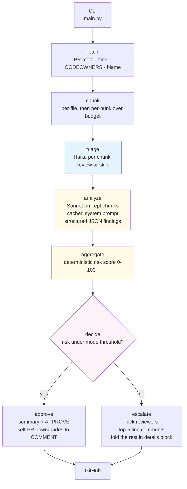

# Yenta 👵

> _Yiddish, n. A matchmaker. Also: a busybody who has opinions about your business._

A LangGraph PR review agent that triages every changed file with Claude Haiku, deep-reviews the non-trivial ones with Claude Sonnet, and either **auto-approves** or **escalates** to specific human reviewers with file/line-cited comments.

Yenta reads a PR end-to-end, forms opinions about it, and then decides what to do — **auto-approve quietly when the change is low-risk, or escalate with line-cited comments when it isn't**. She's a self-sufficient reviewer first; the human reviewers only come in when she escalates.

The name is a wink. A *Yenta* is a Yiddish matchmaker who also happens to have strong opinions about everything she sees — and both halves of that joke apply here. On the escalate branch she matches the diff to the right humans (CODEOWNERS first, `git blame` as a fallback) and tells each one *specifically what to focus on*, drawn from her actual findings on the files they own.

Built for the [Numeo AI Product Engineering Challenge](https://github.com/numeo-ai/numeo-ai-product-engineering-challenge) inside the 6-hour cap.

---

## Demo

**Demo PR**: _link to be added — see the run notes below._

Yenta has been exercised end-to-end against multiple PRs across two modes. On each run she:

1. Fetches the PR + files + CODEOWNERS + recent committers
2. Runs Haiku triage on every changed file (cheap pass — skips lockfiles, formatting, generated stubs)
3. Runs Sonnet analyze on the files triage kept (cached system prompt → ~60% cheaper after the first call)
4. Computes a deterministic risk score
5. **Auto-approves quietly** when risk is under the mode threshold, or **escalates with line comments + reviewer assignments** when it isn't
6. Captures every LLM call to Langfuse (prompt, model, output, tokens, cache hits, latency)

To reproduce the demo end-to-end, see the *How to run against any PR* section below.

---

## Quick start

```bash
git clone <this repo>
cd yenta
python3 -m venv .venv && source .venv/bin/activate
pip install -r requirements.txt
cp .env.example .env  # fill in your tokens
python main.py https://github.com/<org>/<repo>/pull/<n> --mode conservative --dry-run
```

When the dry-run output looks right, drop `--dry-run` and run for real.

### CLI

```bash
python main.py <PR_URL> --mode {conservative|aggressive} [--dry-run]
```

- `PR_URL` — full URL, e.g. `https://github.com/octocat/Hello-World/pull/42`
- `--mode conservative` — escalates eagerly (threshold 25), `REQUEST_CHANGES` event on escalate
- `--mode aggressive` — auto-approves more readily (threshold 60), softer `COMMENT` event
- `--dry-run` — runs the full pipeline (Haiku triage + Sonnet analyze + risk score + decision + reviewer selection + summary) **without posting to GitHub**. Always do this first on a new PR.

### Required env (see `.env.example`)

| Var | Why |
|---|---|
| `GITHUB_TOKEN` | PAT with `repo` + `read:org`. The agent posts as this account. |
| `ANTHROPIC_API_KEY` | Claude API key |
| `ANTHROPIC_MODEL` | Sonnet for deep review. Default `claude-sonnet-4-5`. |
| `ANTHROPIC_TRIAGE_MODEL` | Haiku for triage. Default `claude-haiku-4-5`. |
| `TRIAGE_ENABLED` | Default `1`. Set to `0` to skip the triage step (e.g. when running against PRs you know are 100% real code). |
| `LANGFUSE_PUBLIC_KEY` / `LANGFUSE_SECRET_KEY` / `LANGFUSE_HOST` | Optional but recommended. Without these, traces are no-op. |
| `MAX_TOKENS_PER_FILE_CHUNK` | Default `6000`. Files larger than this are hunk-split. |
| `MAX_LLM_CALLS_PER_RUN` | Default `80`. Hard cap to bound cost on monorepo PRs. |

---

## Architecture



### Three responsibilities, three nodes

- **triage (Haiku)** — fast/cheap perception. Per chunk: "is this worth a deep review, or is it a lockfile bump / formatting change / generated stub?" Defaults to `review` on any uncertainty. Skipped chunks are tracked separately in `state.triage_skipped` (NOT added as findings, so they don't inflate the risk score).
- **analyze (Sonnet)** — deep perception. Per non-skipped chunk: structured JSON findings (severity, category, file, line, rationale, optional suggestion). System prompt is large (~1600 tokens, hits Anthropic's 1024-token cache threshold) and identical across the fan-out → prompt caching reduces input cost on the cached portion to 0.1x.
- **aggregate + decide (code, not LLM)** — deterministic risk score from findings + sensitive-path bonus + PR-size curve + fork bonus + truncation bonus. Decision is 2 lines: `risk_score >= MODE_PROFILES[mode].escalate_threshold`.

### Why LangGraph and not "just an agent loop"

The flow is a fixed DAG with one branch point. A `StateGraph` is the right level of abstraction:

- **Auditable** — each node has one job; the diagram IS the runtime behavior
- **Testable** — node functions take `GraphState` and return a state delta; trivially unit-testable
- **Defensible** — I can point at any node in interview and explain why it's there

A free-form ReAct loop would have been cute but worse on testability and observability.

### Why LLM does perception, code does decision

The Haiku triage produces a literal decision (review/skip). The Sonnet analyze produces structured findings. A **deterministic function** (`aggregate.py`) computes the risk score. A **two-line decision** (`decide.py`) compares it to a mode-specific threshold.

- Reproducible — same findings → same decision, run after run.
- Auditable — interview panel can point at one number per mode (the threshold) and ask "why?".
- The model is never the judge. That's the failure mode for most LLM agents.

---

## Cost analysis (the 1000x scale answer)

Real numbers from the demo PR (3 files, +29 LOC):

| Configuration | Per-run cost |
|---|---|
| v1 (no caching, no triage) | $0.035 |
| v2 (Sonnet analyze caching) | $0.022 |
| v3 (caching + Haiku triage) | $0.023 |

For this 3-file PR, triage adds a small cost (no chunks skipped — all are real React code) but in exchange we get insurance against monorepo PRs.

### Scaling to Numeo

| PR shape | v1 cost | v3 cost | Why |
|---|---|---|---|
| Typical PR (~20 files of mixed real-code + boilerplate) | ~$0.20 | ~$0.10 | Caching halves analyze cost; triage skips ~30% boilerplate |
| Monorepo PR (~80 files w/ lockfile bumps, generated stubs) | ~$0.80 | ~$0.25 | Triage skip rate climbs to 50-60%; cache stays warm |
| 100 PRs/day | $20-80/day | $10-25/day | |
| 1000 PRs/day | $200-800/day | $100-250/day | |

### How the cache actually wins

```
call #1:  cache_create=1660, in=661  ← write phase (1.25x normal cost for cached tokens)
call #2:  cache_create=0,    in=658, cache_read=1660  ← HIT (0.1x normal cost)
call #3:  cache_create=0,    in=253, cache_read=1660  ← HIT
```

Above is real Langfuse output from the demo PR. The 1660 cached tokens are the analyze system prompt (rules + schema + examples).

---

## Design decisions (where the spec is deliberately ambiguous)

| Question the spec leaves open | Decision | Why |
|---|---|---|
| What defines "risk"? | Severity-weighted findings + sensitive-path bonus (`auth/`, `migrations/`, `.env`, workflows, etc.) + PR-size curve + fork bonus + truncation bonus | Auditable. LLM perceives; code decides. |
| Mode difference, *concretely*? | Two knobs: **escalate threshold** (conservative 25, aggressive 60) and **review event** (REQUEST_CHANGES vs COMMENT). Aggressive also drops `low`-severity findings from comments. | Two-knob design keeps modes meaningfully different without sprawl. |
| How are reviewers picked? | CODEOWNERS last-match-wins per file → blame fallback (recency-weighted vote across changed paths) → drop PR author and agent-token-owner → cap 3. | Mirrors what real teams do. Degrades gracefully. |
| Line comments vs PR-level? | Both. Findings with a line number become GitHub line comments; the summary is the review body. Reviewer assignments go through `request_reviewers`; one combined issue comment (NOT N separate ones) addresses each assignee with their specific files/lines. | What a thoughtful human reviewer does, without flooding the PR. |
| Huge PRs (5K/5K)? | Per-file fan-out → hunk-split via `unidiff` when one file overruns `MAX_TOKENS_PER_FILE_CHUNK` → hard cap on total LLM calls. Hit the cap → `state.truncated=True` and the final review honestly says what wasn't reviewed. | Structurally scales; never silently drops. |
| Fork PRs? | Fork bonus (+10) on the risk score plus a safety floor: any fork PR with findings escalates regardless of mode. | Untrusted contributor. Defense in depth. |
| Self-PR? | Detected via `viewer.login == pr_author`. APPROVE / REQUEST_CHANGES are both rejected by GitHub on your own PR (422). The agent downgrades both to COMMENT. Line comments and reviewer assignment still post. | Real-world failure mode; the agent handles it instead of crashing. |
| Re-runs on the same PR? | Each run posts a new review. No dedupe in v1. | Documented limitation. Dedupe is in *Future work*. |
| Hard escalations? | Any `critical` severity finding OR fork PR with any findings → escalate regardless of score. | Safety floor that overrides mode tuning. |
| Triage false skip? | Triage prompt explicitly says "when in doubt, choose review". On Haiku timeout / JSON parse fail → default to review for that chunk. | Cost of a false skip is much higher than a false review. |

---

## Observability — Langfuse

For every LLM call, Langfuse captures:

- **input** (full system + user prompt)
- **output** (raw text from the model)
- **model** (Sonnet vs Haiku — visible per call)
- **usage_details** (`input`, `output`, `cache_creation_input`, `cache_read_input`, `total`)
- **latency** (auto-captured)
- **metadata** (`node`, `file_path`, `hunk_index`, `pr_url`, `mode`, `cache_system`)

Trace hierarchy:

```
pr-review/<owner>/<repo>#<n>          ← root, tagged {mode, repo, dry-run?}
├─ node.fetch                         ← span
├─ node.chunk                         ← span
├─ node.triage                        ← span
│  ├─ anthropic.messages.create       ← generation (Haiku, file_a.js)
│  ├─ anthropic.messages.create       ← generation (Haiku, file_b.js)
│  └─ ...
├─ node.analyze                       ← span
│  ├─ anthropic.messages.create       ← generation (Sonnet, file_a.js, cache_write)
│  ├─ anthropic.messages.create       ← generation (Sonnet, file_b.js, cache_read)
│  └─ ...
├─ node.aggregate                     ← span (input: finding count; output: risk score)
├─ node.decide                        ← span
└─ node.approve OR node.escalate      ← span
   └─ anthropic.messages.create       ← generation (Sonnet, summary)
```

If `LANGFUSE_*` env is absent, the decorators are no-ops — the agent still runs.

---

## What breaks at 1000x scale (and how I'd fix it)

The job post asks *"what breaks first at 1000x scale?"* — so here it is for this agent:

1. **Cost.** Addressed in this build via prompt caching + Haiku triage (see *Cost analysis*). Next move: **bounded concurrency** in analyze (currently sequential — `asyncio.Semaphore(4-8)` would 4-8x throughput at no extra cost).
2. **GitHub secondary rate limits.** PyGithub doesn't surface these well. **Fix:** backoff on 403, dedupe comments by file:line hash on re-runs (idempotent reviews).
3. **Prompt drift without evals.** The spec explicitly lists "eval frameworks for non-deterministic systems" as a role tech area. **Fix:** golden-set of (PR diff → expected finding categories) pairs; run as CI on every prompt change. Langfuse Datasets fits this naturally.
4. **Reviewer signal decay.** CODEOWNERS goes stale; `git blame` returns people who left. **Fix:** decay-weight blame toward last-90-days commits; cross-check assignees against active org membership.
5. **No memory across PRs in a series.** Stacked PRs each reviewed in isolation. **Fix:** small vector store of recent reviews keyed by (author, repo) so we can flag "you keep introducing X".
6. **Provider single-point-of-failure.** Today Claude-only. **Fix:** thin provider abstraction (LiteLLM or hand-rolled) with Claude primary, OpenAI fallback on 5xx — explicitly deferred for the 6-hour budget.
7. **The two-identities self-reviewer edge case** (which the demo PR exposes). **Fix:** `SELF_IDENTITIES` env var letting an operator declare multiple GitHub logins as "all me".
8. **Cache TTL.** Anthropic's ephemeral cache is 5 minutes. Across 1000 PRs/day, cache hit rate is high when the same PR is reviewed multiple times in quick succession, but the daily cache hit rate is mostly the analyze-system reuse within a single PR's per-file fan-out. **Fix at higher volume:** consider the longer-term 1-hour beta cache if Anthropic exposes it stably.

---

## Repo layout

```
.
├── main.py                       # CLI; argparse + LangGraph invocation + structured report
├── pr_agent/
│   ├── config.py                 # RuntimeConfig + MODE_PROFILES + weights + triage knobs
│   ├── state.py                  # Pydantic GraphState (single source of truth)
│   ├── graph.py                  # LangGraph wiring
│   ├── llm.py                    # Anthropic wrapper: cache, model-override, usage capture
│   ├── obs.py                    # Langfuse shim (v3-compatible, no-op fallback)
│   ├── github_client.py          # PyGithub wrapper (one place for I/O)
│   ├── reviewers.py              # CODEOWNERS parser (last-match-wins)
│   └── nodes/
│       ├── fetch.py              # All GH reads, in one place
│       ├── chunk.py              # File -> hunk split with token budget
│       ├── triage.py             # Haiku per-chunk skip/review decision
│       ├── analyze.py            # Sonnet, structured findings (cached system prompt)
│       ├── aggregate.py          # Deterministic risk score
│       ├── decide.py             # 2-line decision
│       ├── approve.py            # APPROVE + LLM summary
│       └── escalate.py           # Reviewer pick + line comments + combined per-reviewer comment
├── prompts/
│   ├── triage_system.md          # Haiku triage rules (~1375 tok)
│   ├── triage_user.md            # Per-call template
│   ├── analyze_system.md         # Sonnet analyze rules + schema (~1615 tok, cached)
│   ├── analyze_user.md           # Per-call template
│   └── summary.md                # PR-level summary prompt
├── tests/test_chunk.py           # Deterministic-logic smoke tests
├── requirements.txt
├── .env.example
└── README.md
```

---

## Running the tests

```bash
pip install -r requirements.txt
pytest -q
```

Tests cover deterministic logic (chunking, risk scoring, CODEOWNERS parsing). LLM-touching nodes are integration-tested by running against a real PR.

---

## Future work (deliberately deferred for the 6-hour cap)

- Provider fallback (Claude → OpenAI) via LiteLLM or hand-rolled wrapper
- Bounded concurrency in analyze (currently sequential)
- Comment dedupe across re-runs against the same PR (idempotent reviews)
- Eval harness — golden-set regression tests for prompt changes (Langfuse Datasets)
- Team mentions in CODEOWNERS (separate GitHub API param)
- `SELF_IDENTITIES` env var to merge multiple operator identities
- Webhook entrypoint — currently one-shot CLI per spec
- Triage system prompt caching (currently below Haiku's higher cache minimum)

---

## AI tools used while building

Built this with **Claude Code** in plan mode + edit mode. The 6-hour build broke into clean phased commits — `git log` reads like a build progression:

```
Phase 1: scaffold + observability skeleton
Phase 2: GitHub fetch + diff chunking
Phase 3: LLM analysis + risk aggregation + decision
Phase 4: real GitHub writes (approve / escalate / reviewers)
Phase 5: README, tests, polish
+ fix(escalate): downgrade REQUEST_CHANGES -> COMMENT on self-PR
+ feat(cli): --dry-run flag
+ fix(quality): hoist no-speculation rule + consolidate reviewer comments
+ feat(cost): Anthropic prompt caching on analyze + rebalanced prompt
+ feat(cost): Haiku triage node — cheap pre-filter before Sonnet analyze
```

The planning step (architecting + resolving spec ambiguity before code) was where most of the value came from. Each subsequent commit then executed against a clear design intent.

---

## How to run against any PR

1. Clone, install, fill `.env`
2. Pick any open GitHub PR you have write access to. Dry-run first:
   `python main.py <PR_URL> --mode conservative --dry-run`
3. Read the structured dry-run report. It shows exactly what Yenta would post — nothing leaves your terminal.
4. Drop `--dry-run` to post for real.
5. Open the PR on GitHub and confirm: review body, line comments (if any), reviewer assignments (if escalated).
6. Open the Langfuse trace and confirm every LLM call's prompt + output + tokens + cache hits are visible.
